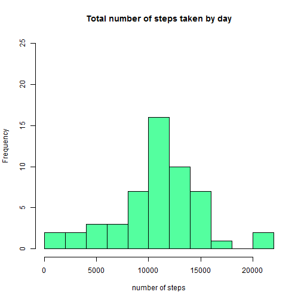
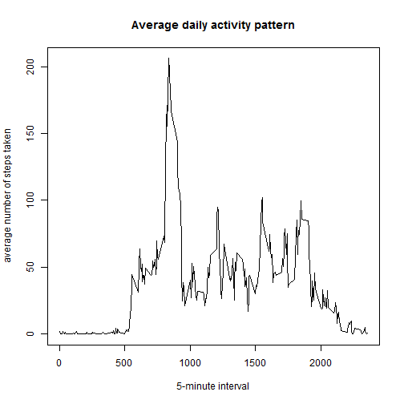
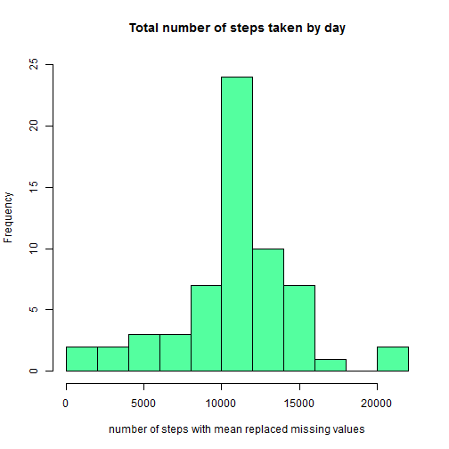
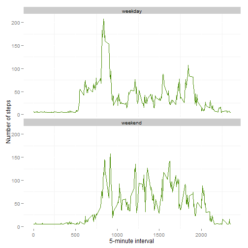

# Reproducible Research: Peer Assessment 1


## Loading and preprocessing the data


```r
unzip(zipfile="activity.zip")
activity <- read.csv("activity.csv")
```

## What is mean total number of steps taken per day?


```r
aggDay<-aggregate(steps ~ date, activity, sum)

hist(aggDay$steps, xlab = "number of steps",ylim=c(0,25),
        main = "Total number of steps taken by day",
     col='seagreen1',breaks=10)
```

 

```r
mSteps<-mean(activity$steps,na.rm=TRUE)

mdSteps<-median(activity$steps,na.rm=TRUE)
```
The mean total number of steps taken per day is 37.3826  
The median total number of steps taken per day is 0

## What is the average daily activity pattern?


```r
aggInterval<-aggregate(steps ~ interval, activity, mean)

plot(aggInterval$interval,aggInterval$steps, type="l",
     main='Average daily activity pattern',
     xlab='5-minute interval',
     ylab='average number of steps taken')
```

 

## Imputing missing values

```r
activityMV<-activity

activityMV$steps[is.na(activityMV$steps)]<-mean(activityMV$steps,na.rm=TRUE)

aggDayMV<-aggregate(steps ~ date, activityMV, sum)

hist(aggDayMV$steps, xlab = "number of steps with mean replaced missing values",
     main = "Total number of steps taken by day",ylim=c(0,25),
     col='seagreen1',breaks=10)
```

 

```r
mStepsMV<-mean(activityMV$steps,na.rm=TRUE)

mdStepsMV<-median(activityMV$steps,na.rm=TRUE)
```
After replacing missing values with the global mean, both the new mean total number 
of steps taken per day (37.3826) and the median total number of steps taken 
per day (0) remains the same.  
When missing values were replaced, the major effect was an increase in the kurtosis of the histogram because empty values had been replaced with the mean

## Are there differences in activity patterns between weekdays and weekends?


```r
day <- weekdays(as.Date(activity$date,format='%Y-%m-%d'))

wday<-ifelse (day=='Saturday'|day=='Sunday','weekend','weekday')

activityMV$wday <- wday

averages <- aggregate(steps ~ interval + wday, data=activityMV, mean)

library(ggplot2)

ggplot(averages, aes(interval,steps))+
        geom_line(color="chartreuse4")+
        facet_wrap(~wday, nrow=2)+
        xlab("5-minute interval")+
        ylab("Number of steps")+
        theme(panel.background=element_blank())
```

 
